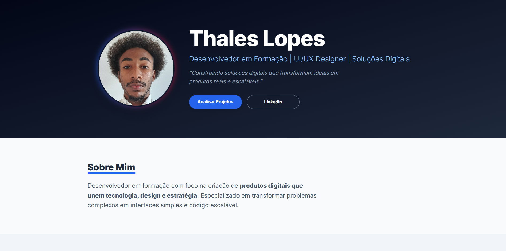

<div align="center">

# 💼 Portfólio | Thales

Meu portfólio pessoal desenvolvido para apresentar meus projetos, habilidades e evolução como desenvolvedor de software.

🔗 **Acesse o projeto:**  
<https://thalesconstruct-sketch.github.io/portfolio/>

<br>


</div>

---

# 📸 Preview

<p align="center">
  
</p>

---

# 📖 Sobre o projeto

Este repositório contém o código-fonte do meu portfólio pessoal.

O projeto foi desenvolvido para reunir minhas principais experiências, projetos e habilidades em um único lugar, permitindo que recrutadores e outros desenvolvedores conheçam melhor meu trabalho.

Além da apresentação dos projetos, o portfólio também demonstra minha preocupação com organização, responsividade e experiência do usuário.

---

# ✨ Funcionalidades

- ✅ Página inicial com apresentação profissional
- ✅ Seção "Sobre Mim"
- ✅ Exibição dos principais projetos
- ✅ Links para GitHub e LinkedIn
- ✅ Layout responsivo
- ✅ Navegação intuitiva
- ✅ Interface moderna

---

# 🛠 Tecnologias

| Tecnologia | Categoria | Utilização |
|------------|-----------|------------|
| HTML5 | Front-end | Estrutura da aplicação |
| CSS3 | Front-end | Estilização e responsividade |
| JavaScript | Front-end | Interatividade |
| Tailwind CSS | Framework CSS | Construção da interface |
| Git | Versionamento | Controle de versão |
| GitHub Pages | Deploy | Hospedagem da aplicação |

---

# 📁 Estrutura do projeto

```text
portfolio/
│
├── .vscode/
├── assetsport/
│   ├── preview.png
│   ├── thales.jpg
│   ├── Hanami.png
│   ├── Fiscalizei.png
│   ├── Drudge.png
│   └── ...
│
├── index.html
└── README.md
```

---

# 🚀 Como executar

Clone o repositório:

```bash
git clone https://github.com/thalesconstruct-sketch/portfolio.git
```

Entre na pasta do projeto:

```bash
cd portfolio
```

Abra o arquivo `index.html` no navegador.

---

# 📚 Aprendizados

Durante o desenvolvimento deste projeto pratiquei:

- Estruturação semântica em HTML;
- Organização de layouts responsivos;
- Criação de interfaces modernas;
- Versionamento com Git e GitHub;
- Publicação utilizando GitHub Pages;
- Organização de projetos para portfólio.

---

# 🎯 Próximas melhorias

- [ ] Adicionar novos projetos
- [ ] Criar versão em inglês
- [ ] Implementar modo escuro
- [ ] Melhorar acessibilidade
- [ ] Adicionar animações
- [ ] Integrar formulário de contato
- [ ] Adicionar página individual para cada projeto

---

# 👨‍💻 Autor

**Thales**

🎓 Estudante de Análise e Desenvolvimento de Sistemas

💻 Desenvolvedor em formação

---

## 📬 Contato

- GitHub: https://github.com/thalesconstruct-sketch
- LinkedIn: https://www.linkedin.com/in/SEU-LINKEDIN
- Portfólio: https://thalesconstruct-sketch.github.io/portfolio/

---

<div align="center">

⭐ Se este projeto foi útil ou interessante para você, considere deixar uma estrela no repositório.

</div>
